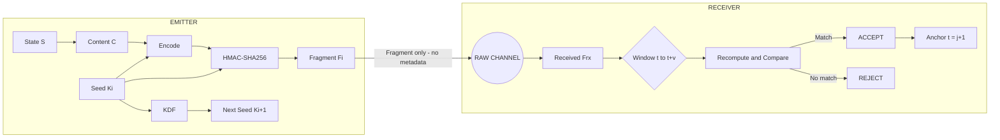
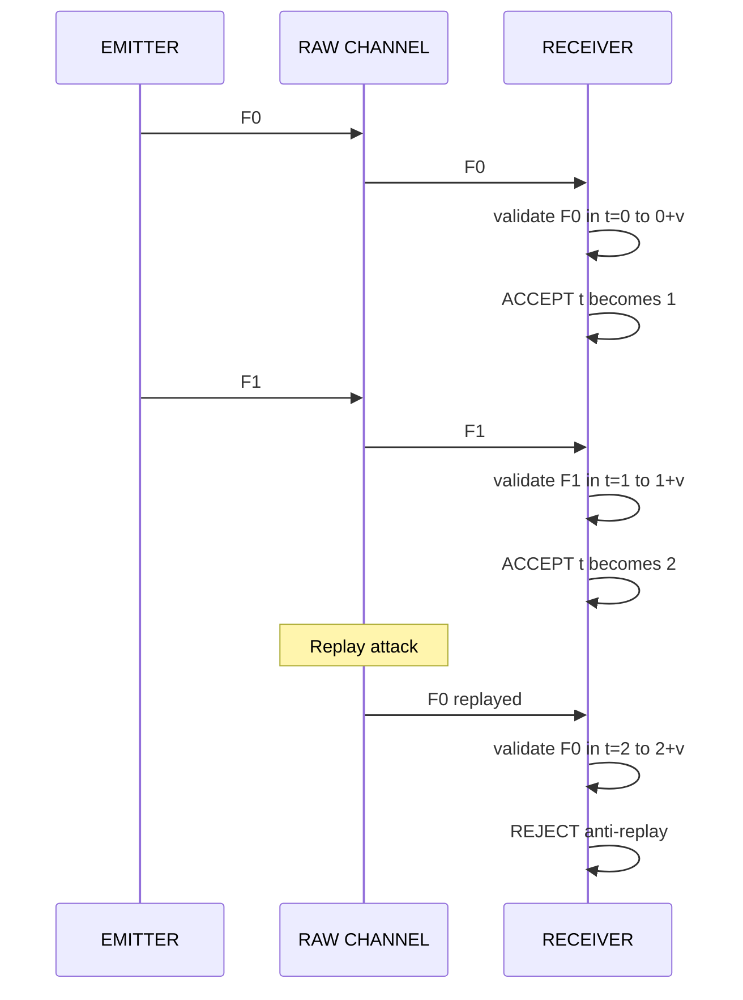

# AION — Asemantic Protocol PoC

**"The invisible is what constitutes the visible."**

[](https://colab.research.google.com/github/asemantix/asemantic-protocol/blob/main/ASEMANTIX_PoC_Demo.ipynb)  
[](https://asemantix.tech)
[](https://python.org)
[]()

**[▶ Try the PoC in Colab](#try-the-poc-in-colab) • [⬇ Install](#install) • [▶ Demo](#demo) • [Documentation](https://asemantix.tech)**

---

## What is this?

A data transmission method: **off-network**, **metadata-free**, based on **self-contained fragments**.  
**Validation is local: nothing transits on the channel.**

This is the Proof of Concept Python implementation of the asemantic fragment validation protocol described in the patent:

> *"Procédé de validation exclusivement locale de fragments asémantiques auto-porteurs, avec fenêtre bornée et ancre monotone"*

The company behind this work is **AION**.

**Key features:**

- Fragments are **indistinguishable from random noise** (NIST SP 800-22: 100% pass)
- No explicit metadata is transmitted: **no index, no timestamp, no headers**
- Validation is performed **locally** within a bounded window [t, t+ν]
- A **monotonic anchor** provides built-in anti-replay behavior
- A KDF-based seed evolution ensures **forward secrecy**

This PoC is intended for **demonstration and evaluation** only. It is **not production-ready**.

---

## Try the PoC in Colab

Run the full end-to-end demo directly in your browser, with no local installation:

[](https://colab.research.google.com/github/asemantix/asemantic-protocol/blob/main/ASEMANTIX_PoC_Demo.ipynb)

The Colab notebook `ASEMANTIX_PoC_Demo.ipynb`:

- Simulates fragment generation in **Mode A** (seed-based)
- Sends fragments over a **raw heterogeneous channel** (no structure, no metadata)
- Performs **local validation** with a bounded window [t, t+ν]
- Demonstrates **anti-replay protection** by sliding the monotonic anchor

---

## Install

Install the PoC directly from GitHub using `pip`:

```bash
pip install git+https://github.com/asemantix/asemantic-protocol.git
```

**Requirements:**

- Python ≥ 3.8
- A standard POSIX-like environment (Linux, macOS, WSL, etc.)

After installation, you can run the minimal demo locally (see `examples/demo_minimal.py`).

---

## How it works

### Protocol overview



### Validation rule

```
ACCEPT(Frx) if and only if: ∃ j ∈ [t, t+ν] such that Frx == Fⱼ

Where:
  - t = current monotonic anchor
  - ν = window size (default: 7)
  - Fⱼ = recomputed fragment at index j
```

### Anti-replay protection



### Fragment is indistinguishable from noise

Fragments are computed as:

```
Fi = HMAC-SHA256(Ki, C || i || d)

Where:
  - Ki: evolving secret seed (K0, K1, ...)
  - C: content (optional in Mode A PoC)
  - i: implicit index (not transmitted)
  - d: domain separation tag (at least 128 bits)
```

In the PoC, we validated that:

- Hamming weight of fragments is statistically balanced
- NIST SP 800-22 tests are all passed on generated sequences
- No detectable structure leaks index, time, or state

---

## Demo (end-to-end trace)

A typical execution of the PoC in Mode A shows:

```
=== Provisioning ===
Domain tag (hex): 83a4...c1f2 (128 bits)
Initial seed K0 (hex): 9f2b...7cde (256 bits)
Window size v: 7

=== Emission F0 ===
F0 (hex, truncated): c76566ec7e80ab7d ... 6b0d2de7e8ae7dfd

=== Reception F0 ===
Before validation: anchor t = 0
Validation result F0: ACCEPT at index j* = 0
After validation: anchor t = 1

=== Emission F1 ===
F1 (hex, truncated): f4bbce6c03ede07d ... a6b0bceb55ae9669

=== Reception F1 ===
Before validation: anchor t = 1
Validation result F1: ACCEPT at index j* = 1
After validation: anchor t = 2

=== Replay of F0 (replay attack) ===
F0 (replayed) hex truncated: c76566ec7e80ab7d ... 6b0d2de7e8ae7dfd
Validation result F0 replayed: REJECT
Returned index: None
Anchor t remains = 2 (no movement)
```

---

## API usage

```python
from asemantic_protocol import (
    FragmentBuilder,
    FragmentValidator,
    ReceiverState,
    generate_seed,
    generate_domain_tag,
)

# Provisioning (shared out-of-band)
domain = generate_domain_tag()  # 128 bits
seed = generate_seed()          # 256 bits

# Emitter side
builder = FragmentBuilder.mode_a(domain, seed)
fragment = builder.build(b"SECRET_MESSAGE")
builder.advance()  # K1 = KDF(K0)

# Receiver side
state = ReceiverState.mode_a(seed)
validator = FragmentValidator(domain, window_size=7)

result, index = validator.validate_and_commit(
    fragment,
    state,
    b"SECRET_MESSAGE",
)
# result = ValidationResult.ACCEPT
# index  = 0
# state.anchor = 1
```

---

## Project structure

```
asemantic-protocol/
├── README.md
├── pyproject.toml
├── ASEMANTIX_PoC_Demo.ipynb      # Google Colab notebook
├── asemantic_protocol/
│   ├── __init__.py               # Public API
│   ├── crypto.py                 # KDF, compute_fragment, constant_time_equal
│   ├── fragment.py               # FragmentBuilder (Mode A / Mode B)
│   ├── state.py                  # ReceiverState, monotonic anchor
│   └── validator.py              # FragmentValidator, windowed validation
└── examples/
    └── demo_minimal.py           # Minimal end-to-end demo
```

---

## Patent claims demonstrated (PoC coverage)

| Claim | Description | Implementation |
|-------|-------------|----------------|
| 1 | Windowed recomputation + strict equality | `FragmentValidator.validate()` |
| 3 | Mode A — secret seed with forward secrecy | `FragmentBuilder.mode_a()` + KDF |
| 7 | Early stop on first match | internal loop in `_validate_mode_a()` |
| 8 | Fragment length L ≥ 256 bits | `DEFAULT_FRAGMENT_LENGTH = 256` |
| 9 | Monotonic anchor (anti-replay) | `ReceiverState.advance()` |
| 17 | No persistent list of accepted fragments | state = (anchor, seed) only |
| 18 | Domain separation d ≥ 128 bits | `generate_domain_tag()` (128-bit tag) |

---

## Performance (reference PoC measurements)

| Metric | Value (indicative PoC numbers) |
|--------|--------------------------------|
| Fragment generation | > 20,000 / second |
| Fragment validation | > 20,000 / second |
| Latency | < 50 µs |
| NIST SP 800-22 | 100% pass (6/6 tests) |

These values are indicative for a single-threaded Python implementation on a commodity laptop and are **not** optimized for production.

---

## License

**Proprietary — All rights reserved.**

This code is provided for **demonstration and evaluation** purposes only.

---

<p align="center">
  <strong>AION</strong><br>
  <strong>ASEMANTIX™</strong><br><br>
  <em>"The invisible is what constitutes the visible."</em><br>
  The dawn of invisible communication.<br><br>
  <strong>Zero metadata. Zero trace. Zero boundary.</strong><br>
  From Earth to Mars — and beyond.<br><br>
  Contact: <a href="mailto:ASEMANTIX@proton.me">ASEMANTIX@proton.me</a><br>
  Website: <a href="https://asemantix.tech">asemantix.tech</a>
</p>
